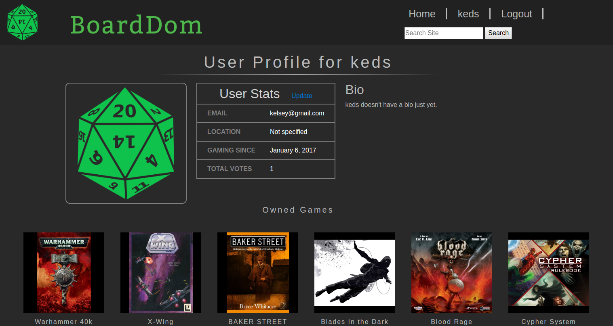
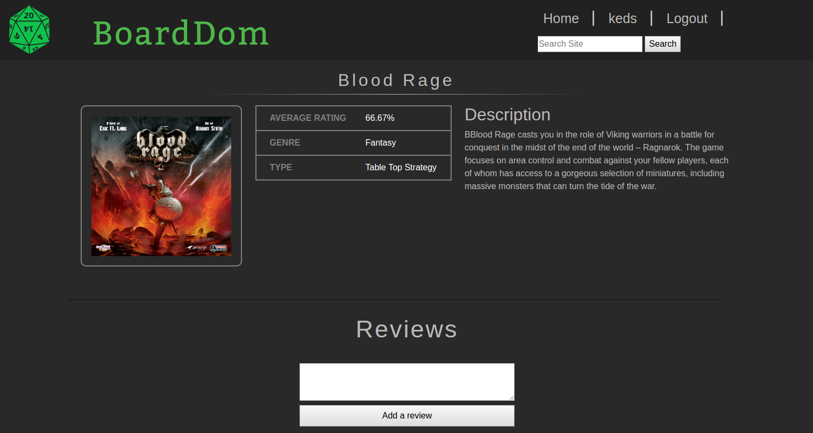

## BoardDom

### Introduction

BoardDom is a social networking application built for people who play board games. As a user, you can add a game to your collection, "like" or "dislike" a game, and search for users with similar tastes to facilitate fun and diverse board game nights.

BoardDom was designed in 3 days as a Dev Bootcamp client simulation. We practiced Agile methodologies in order to accomodate shifting client demands.

### Contributors

* Jack Shelley
* Kelsey Edelstein
* Cory Mathis
* Patrick Anderson

### Configuration and Dependencies

* Rails 5.0.0.1
* Ruby 2.2.2
* Deployment Server: Heroku
* Database: PostgreSQL 9.5.5
* Test Suite: RSpec
* Security: Devise

### Get Started

To get started using BoardDom, clone the repository and install all gem dependencies:
```
bundle install
```
Create and populate the database with board games and users:
```
rails db:create
rails db:migrate
rails db:seed 
```
Start the local server and navigate to `http://localhost:3000` in your browser:
```
rails s
```
Manage the database:
```
rails c
```
###Homepage


###User Profile


###Game Detail


###License
This project is licensed under the terms of the MIT license.
